

# Valorant-Spind

### Wie viel ist dein Valorant-Spind wert? Kostenlose Windows-App mit Spind-Wert, Coach, 2D-Match-Replay & 40+ Statistiken – dazu 40+ Gratis-Tools auf der Website

[🇬🇧 English](README.md) · **🇩🇪 Deutsch**

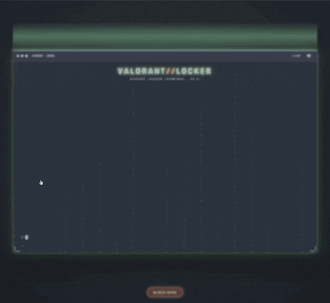

Echtzeit-Aufnahme des Login-Intros in v2.5 (englische Oberfläche) – Riot-ID unkenntlich gemacht · <a href="media/hacking-login-intro-en.mp4">MP4-Version</a>

---

## Was ist Valorant-Spind?

**Valorant-Spind** ist ein unabhängiges deutsches Fan-Projekt rund um Valorant – kein offizielles Riot-Produkt. Es besteht aus zwei Teilen:

1. **Die kostenlose Desktop-App** für Windows – liest deinen Spind lokal aus und wertet deine Matches wie ein persönlicher Coach aus.
2. **Die Website [valorant-spind.de](https://www.valorant-spind.de/)** – über 160 Seiten mit Rechnern, Guides und interaktiven Tools, jeweils auf Deutsch und Englisch, werbefrei.

> **100 % lokal · kein Account · kein Tracking · keine Werbung · Fan-Projekt**

💬 **Komm in die Community auf Discord:** [discord.com/invite/rKqNGPE3hS](https://discord.com/invite/rKqNGPE3hS) – App-News, Changelog, Feedback, Mitspielersuche & Giveaways.

---

## 🖥️ Die Valorant-Spind App – Version 2.5

Die kostenlose Windows-App (**aktuelle Version: 2.5 – das Präzisions-Update**, erschienen am 4. Oktober 2026) verbindet sich lokal mit deinem laufenden Riot-Client – **ohne Login, ohne Zugangsdaten, ohne Cloud**. Alles bleibt auf deinem PC.

### 🆕 Neu in 2.5 – das Präzisions-Update

| Funktion | Was sie kann |
|---|---|
| 🎯 **Präzisions-Analyse im Coach** | Ein Siegchancen-Modell aus deinen gespeicherten Runden bewertet jeden Kill, Tod, Plant und Defuse nach seiner echten Wirkung (Round-Swing). Rollenfairer Lobby-Vergleich („besser als X % der Spieler in deiner Rolle“) und **deine 3 größten Hebel** – jeweils mit Zahl, Sicherheitsstufe und konkretem Trainingstipp. Läuft lokal – keine KI, kein Upload. |
| 📍 **Callouts – wo du stirbst** | Deine Todes- und Kill-Orte in offiziellen Map-Callouts wie „B Tower“ oder „A Main“, je Map und Seite. |
| 🔫 **Waffen- & Trade-Distanz** | Duell-Winrate je Waffe und Distanz, Median-Kill-Distanz und wie oft dein Tod getradet wird – abhängig vom Abstand zu deinem Team. |
| ⭐ **Riot Performance Score** | Riots eigene Bewertung (0–500) mit den 8 Bewertungspfeilen, Verlauf und Lobby-Vergleich. |
| 📈 **Echte RR-Bilanz & Rang-Karriere** | Netto-RR auf der echten Rangleiter, Derank-Schutz, Auf- und Abstiege – dazu Endrang und Peak je Akt. |
| 👤 **Multi-Account-Wächter** | Erkennt Account-Wechsel automatisch und lädt Spind und Coach für den richtigen Account neu. |

### ⭐ Kernfunktionen

| Funktion | Was sie kann |
|---|---|
| 💰 **Spind-Wert** | Erkennt **jeden Skin, jedes Messer, jeden Spray & jede Karte** in deiner Sammlung, summiert die Valorant Points und rechnet den Gesamtwert in **Euro** um. Du wählst deine **Preis-Region**, damit der Euro-Wert zu deinem Store passt. |
| 🎬 **2D-Match-Replay** | Spielt deine Matches **Kill für Kill** in einer 2D-Taktikansicht nach – Positionen und Blickrichtungen aller Spieler, dazu ein Highlight-Finder für Aces & Multikills. |
| 🗺️ **Coach & Kill-Heatmaps** | Analysiert deine echten Ranked-Matches: Kill-/Death-Heatmaps auf der echten Map, Aim-Analyse & Trend, Spieler-Radar und Rang-Perzentil. |
| 🛒 **Shop & Nachtmarkt** | Täglicher Shop, Featured-Bundle, Zubehör-Shop und Nachtmarkt direkt in der App. |
| 🔒 **100 % lokal** | Kein Login, keine Zugangsdaten, nichts wird an den Entwickler hochgeladen. Läuft, während Valorant offen ist. |

### ⬇️ [App kostenlos herunterladen](https://www.valorant-spind.de/valorant-spind-app.html) · 📜 [Changelog](https://www.valorant-spind.de/changelog.html) · 💬 [Discord](https://discord.com/invite/rKqNGPE3hS)

---

## 🌐 Die Website: 40+ Tools & Guides

Alle Bilder (Skins, Agenten, Ränge, Maps) stammen live aus der **offiziellen Valorant-API**. Alles zweisprachig, dark, mobil-optimiert.

### 🧰 Interaktive Tools

- **[Gather Organizer](https://www.valorant-spind.de/valorant-gather.html)** 🆕 – 5v5-Pickup/Scrim wie ein ESL-Gather: faire Teams (Auto-Balance oder Captain-Draft), Map-Veto, Match-Sheet + Discord-Post & Teilen-Link
- **[Team-Comp-Builder](https://www.valorant-spind.de/valorant-team-comp-builder.html)** – die stärkste 5er-Aufstellung pro Map
- **[Duo- & Trio-Finder](https://www.valorant-spind.de/valorant-duo-finder.html)** – beste Agenten-Kombis pro Map
- **[Crosshair-Generator](https://www.valorant-spind.de/valorant-crosshair-generator.html)** + [237 Pro-Crosshairs](https://www.valorant-spind.de/valorant-pro-crosshair-datenbank.html)
- **[Aim-Trainer](https://www.valorant-spind.de/valorant-aim-trainer.html)**, **[Sensitivity-Converter](https://www.valorant-spind.de/valorant-sensitivity-converter.html)** & **[eDPI-Rechner](https://www.valorant-spind.de/valorant-edpi.html)**
- **[RR-Rechner](https://www.valorant-spind.de/valorant-rr-rechner.html)**, **[Rang-Flex-Card](https://www.valorant-spind.de/valorant-rang-flex-card.html)** & **[Battlepass-Rechner](https://www.valorant-spind.de/valorant-battlepass-rechner.html)**
- **[Night-Market-Simulator](https://www.valorant-spind.de/valorant-night-market-simulator.html)**, **[Callout-Trainer](https://www.valorant-spind.de/valorant-map-callout-trainer.html)** & **[Map-Strategy-Board](https://www.valorant-spind.de/valorant-map-strategy-board.html)**
- **[Agenten-Konter-Finder](https://www.valorant-spind.de/valorant-agent-konter-finder.html)** – der beste Pick gegen die gegnerische Comp, dazu [Pickrates](https://www.valorant-spind.de/valorant-agenten-pickrates.html)
- **[Skin-Quiz](https://www.valorant-spind.de/valorant-skin-quiz.html)**, **[Skin-Persönlichkeitstest](https://www.valorant-spind.de/valorant-skin-persoenlichkeitstest.html)** & **[Agenten-Quiz](https://www.valorant-spind.de/valorant-agenten-quiz.html)** – finde deinen Main & deinen Signature-Skin
- **[Strat-Roulette](https://www.valorant-spind.de/valorant-strat-roulette.html)**, **[Valorant-Bingo](https://www.valorant-spind.de/valorant-bingo.html)** & **[Namen-Generator](https://www.valorant-spind.de/valorant-namen-generator.html)** – Spaß für die ganze Lobby
- **[VP-Rechner](https://www.valorant-spind.de/valorant-vp-rechner.html)**, **[Store-Checker](https://www.valorant-spind.de/valorant-store-checker.html)** & **[Night-Market-Termin](https://www.valorant-spind.de/valorant-night-market-termin.html)**

### 💰 Skins, Wert & Shop

- **[Skins-Wert berechnen](https://www.valorant-spind.de/valorant-skins-wert.html)** · [Account-Wert](https://www.valorant-spind.de/valorant-account-wert.html) · [Skin-Rechner](https://www.valorant-spind.de/valorant-skin-rechner.html)
- [Teuerste Skins](https://www.valorant-spind.de/teuerste-valorant-skins.html) · [Beste Vandal-](https://www.valorant-spind.de/valorant-beste-vandal-skins.html) / [Phantom-](https://www.valorant-spind.de/valorant-beste-phantom-skins.html) / [Operator-Skins](https://www.valorant-spind.de/valorant-beste-operator-skins.html)
- [Bundles](https://www.valorant-spind.de/valorant-bundles.html) · [Points/VP](https://www.valorant-spind.de/valorant-points-preise.html) · [Radianite](https://www.valorant-spind.de/valorant-radianite.html)

### 📚 Guides & Wissen

- **[29 Agenten-Guides](https://www.valorant-spind.de/valorant-agenten.html)**, [Tier-List](https://www.valorant-spind.de/valorant-agenten-tier-list.html) & [Pickrates](https://www.valorant-spind.de/valorant-agenten-pickrates.html)

  **Jeder Agent im Detail:** [Astra](https://www.valorant-spind.de/valorant-agent-astra.html) · [Breach](https://www.valorant-spind.de/valorant-agent-breach.html) · [Brimstone](https://www.valorant-spind.de/valorant-agent-brimstone.html) · [Chamber](https://www.valorant-spind.de/valorant-agent-chamber.html) · [Clove](https://www.valorant-spind.de/valorant-agent-clove.html) · [Cypher](https://www.valorant-spind.de/valorant-agent-cypher.html) · [Deadlock](https://www.valorant-spind.de/valorant-agent-deadlock.html) · [Fade](https://www.valorant-spind.de/valorant-agent-fade.html) · [Gekko](https://www.valorant-spind.de/valorant-agent-gekko.html) · [Harbor](https://www.valorant-spind.de/valorant-agent-harbor.html) · [Iso](https://www.valorant-spind.de/valorant-agent-iso.html) · [Jett](https://www.valorant-spind.de/valorant-agent-jett.html) · [KAY/O](https://www.valorant-spind.de/valorant-agent-kay-o.html) · [Killjoy](https://www.valorant-spind.de/valorant-agent-killjoy.html) · [Miks](https://www.valorant-spind.de/valorant-agent-miks.html) · [Neon](https://www.valorant-spind.de/valorant-agent-neon.html) · [Omen](https://www.valorant-spind.de/valorant-agent-omen.html) · [Phoenix](https://www.valorant-spind.de/valorant-agent-phoenix.html) · [Raze](https://www.valorant-spind.de/valorant-agent-raze.html) · [Reyna](https://www.valorant-spind.de/valorant-agent-reyna.html) · [Sage](https://www.valorant-spind.de/valorant-agent-sage.html) · [Skye](https://www.valorant-spind.de/valorant-agent-skye.html) · [Sova](https://www.valorant-spind.de/valorant-agent-sova.html) · [Tejo](https://www.valorant-spind.de/valorant-agent-tejo.html) · [Veto](https://www.valorant-spind.de/valorant-agent-veto.html) · [Viper](https://www.valorant-spind.de/valorant-agent-viper.html) · [Vyse](https://www.valorant-spind.de/valorant-agent-vyse.html) · [Waylay](https://www.valorant-spind.de/valorant-agent-waylay.html) · [Yoru](https://www.valorant-spind.de/valorant-agent-yoru.html)
- [Alle Maps](https://www.valorant-spind.de/valorant-maps.html) · [Ränge Iron–Radiant](https://www.valorant-spind.de/valorant-ranks.html) · [Einsteiger-Guide](https://www.valorant-spind.de/valorant-einsteiger-guide.html)
- **[Gaming-PC-Kaufberater](https://www.valorant-spind.de/valorant-gaming-pc.html)** – ehrlicher Test mit Bottleneck-Check

---

## 📸 App-Screenshots (v2.5)

**💰 Spind-Wert-Dashboard – Gesamtwert in VP & €, Rang und Lieblings-Agent**

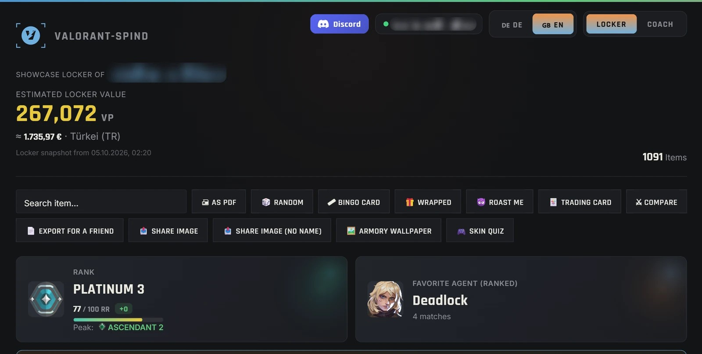

| 🎬 2D-Match-Replay – Kill für Kill | 🎯 Coach-Präzisions-Analyse – deine 3 größten Hebel |
|:--:|:--:|
| 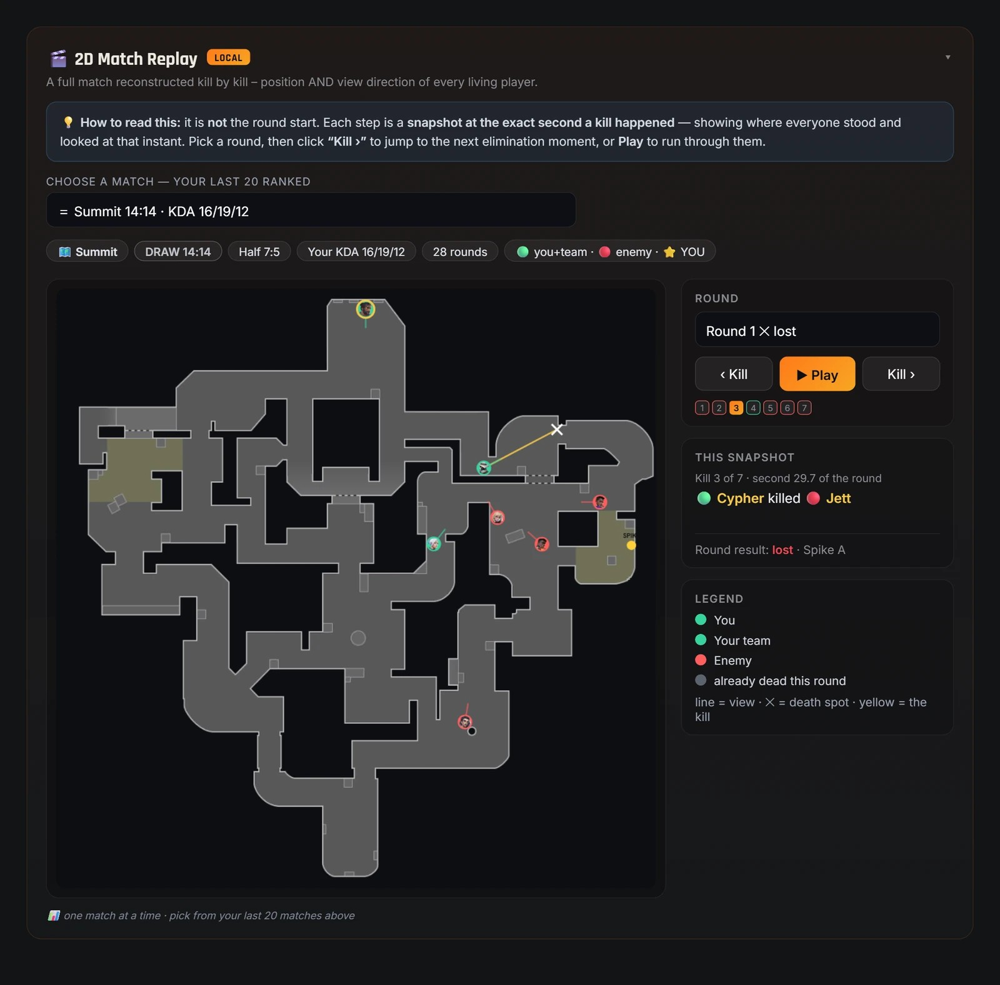 | 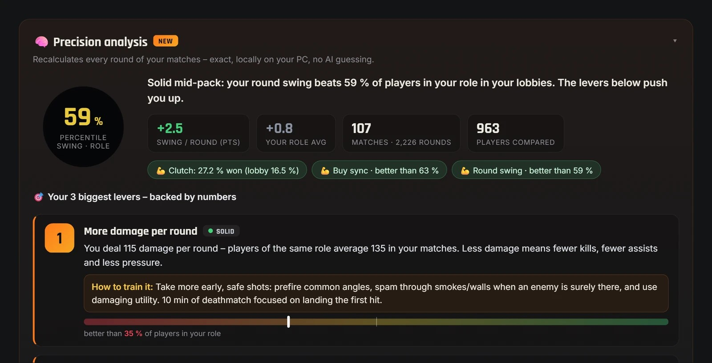 |
| **🗺️ Kill-Heatmap auf der echten Map** | **🎯 Crosshair-Placement-Röntgen** |
| 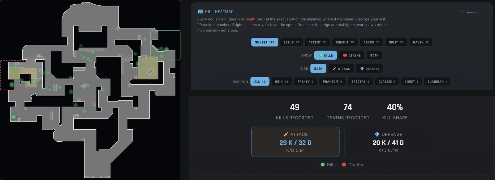 | 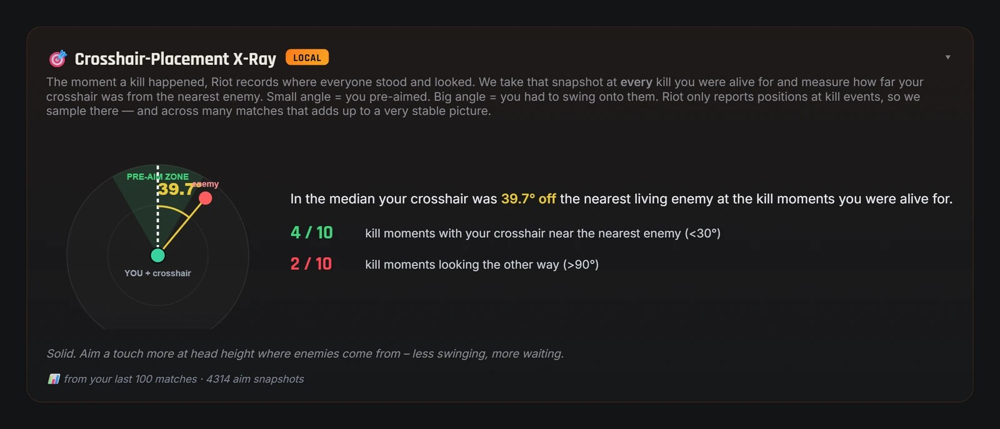 |
| **📍 Callouts & Waffen-Distanz** | **⭐ Riot Performance Score & RR-Bilanz** |
| 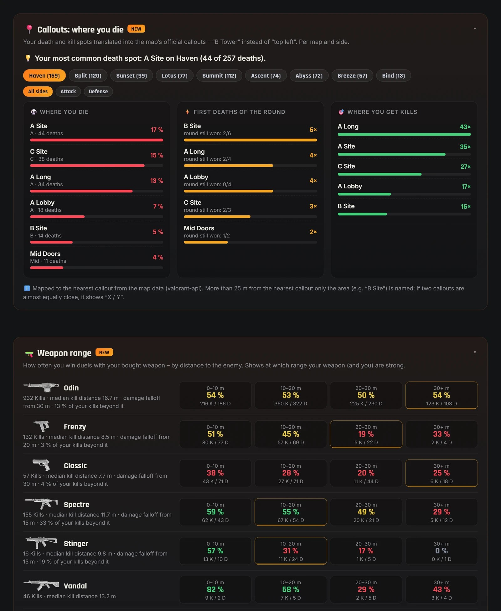 | 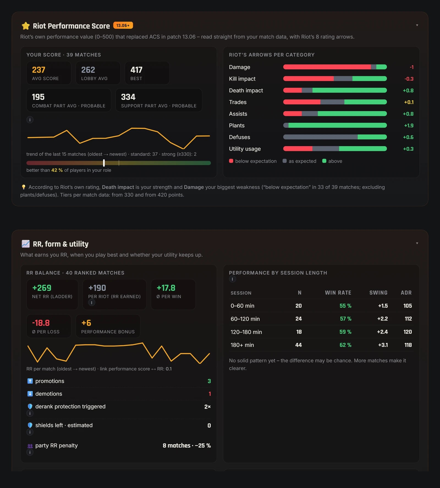 |
| **🧬 Spieler-Radar & Rang-Perzentil** | **💎 Skin-Galerie & Seltenheits-Score** |
| 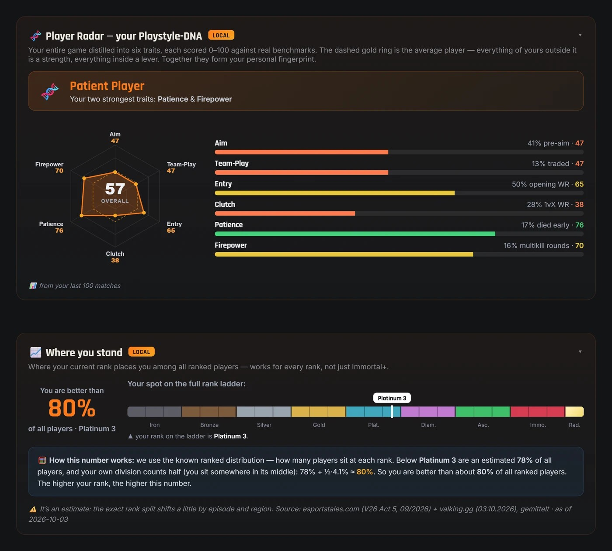 | 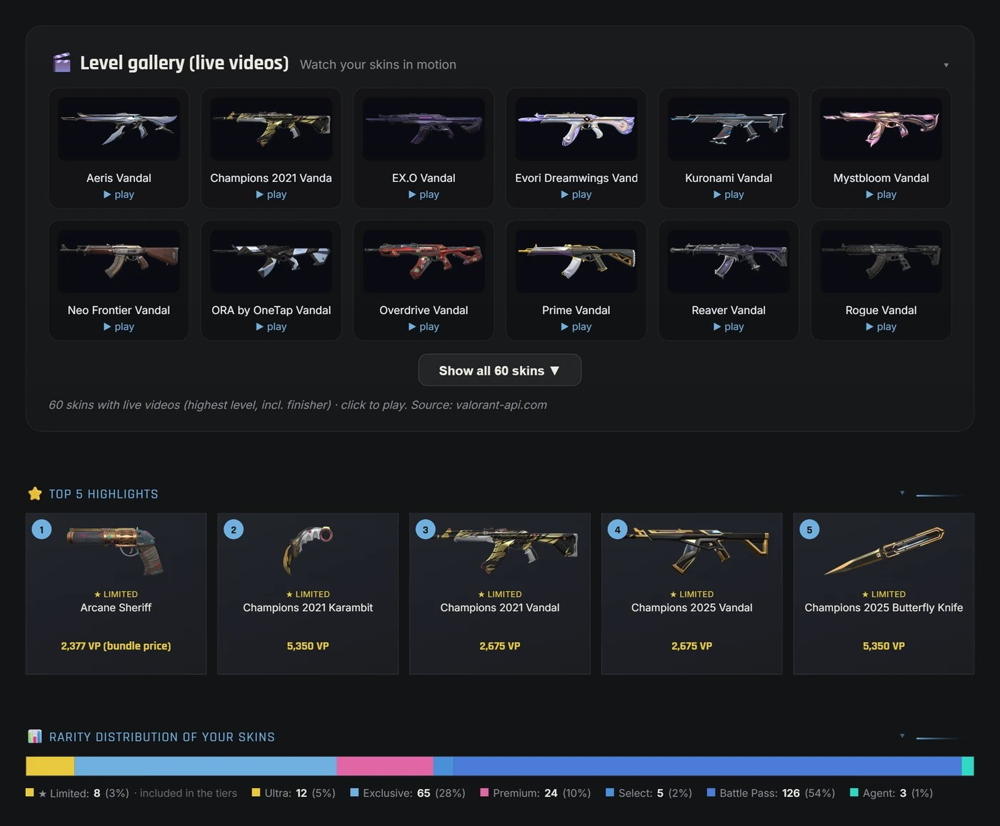 |

**🛒 Täglicher Shop, Featured-Bundle & Nachtmarkt**

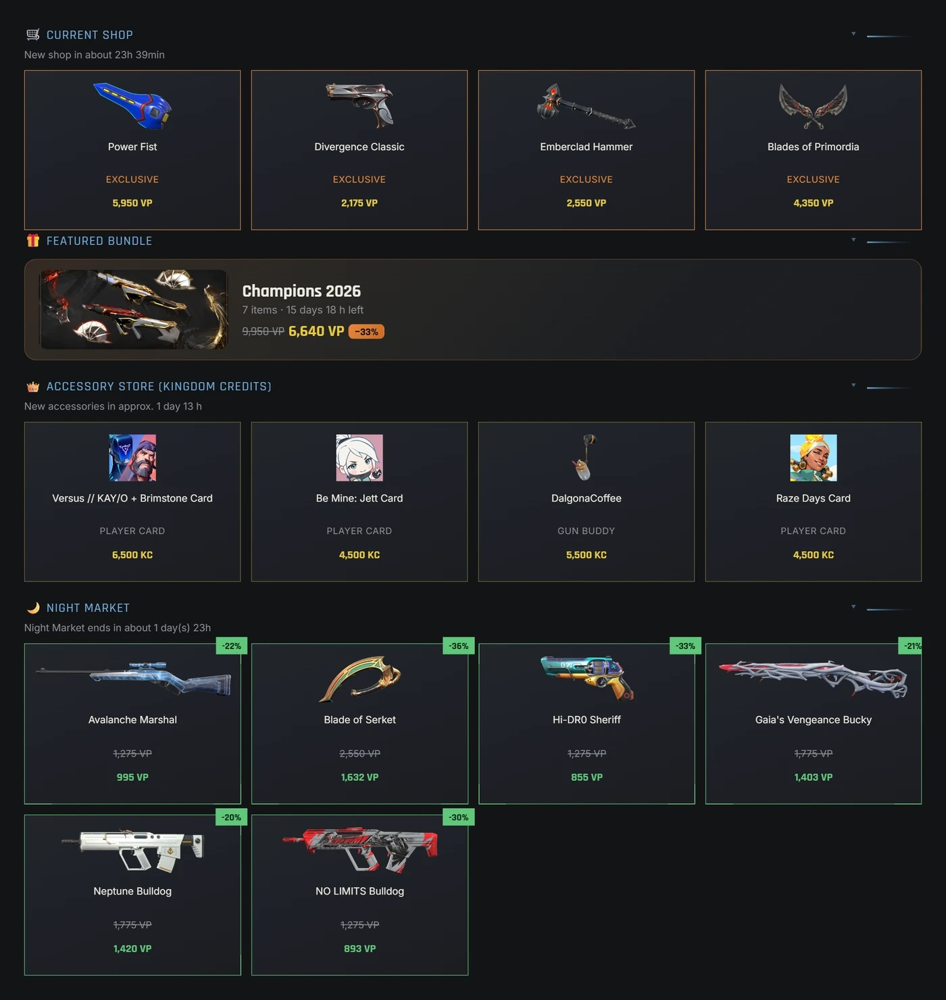

> Alle Screenshots sind echte Aufnahmen der kostenlosen Valorant-Spind Desktop-App v2.5 (englische Oberfläche). Spielernamen sind unkenntlich gemacht.

---

## 🛠️ Technik

- **App:** Python mit Eel-Oberfläche in HTML/CSS/JS, als eigenständiger Windows-Installer gepackt
- **Statische Website** (HTML/CSS/JS), über 160 Seiten pro Sprache, ohne Framework – schnell & wartbar
- **Zweisprachig DE/EN** über `<html lang>` + `data-de`/`data-en`
- **Design:** Dark-Theme, Markenfarbe `#E8863C`, Schriften Rajdhani + Inter
- **Bilder** live aus der offiziellen Valorant-API (media.valorant-api.com über wsrv.nl)
- **SEO:** Schema.org (WebApplication/FAQPage), Open Graph, hreflang, Sitemap, saubere Canonicals

---

## 🔗 Links

- 🌐 Website: **https://www.valorant-spind.de**
- ⬇️ App-Download: **https://www.valorant-spind.de/valorant-spind-app.html**
- 💬 Discord: **[discord.com/invite/rKqNGPE3hS](https://discord.com/invite/rKqNGPE3hS)**
- 📜 Changelog: **https://www.valorant-spind.de/changelog.html**
- 🎵 TikTok: **[@valorantspind](https://www.tiktok.com/@valorantspind)**

---

## ⚖️ Rechtliches

Valorant-Spind ist ein inoffizielles Fan-Projekt und steht in **keiner Verbindung zu Riot Games**. VALORANT sowie alle zugehörigen Marken, Logos und Assets sind Eigentum von Riot Games, Inc. Die App fragt **keine Zugangsdaten** ab und speichert keine persönlichen Daten auf einem Server.

**Made with 🧡 for the German Valorant community**

